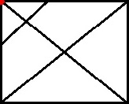

<h1>空间重构</h1>

## 1. 折纸盒类
### 1.1. 相对面的判定
在一个立体图形中出现的三个面不可能为相对面。
1. 同行同列相隔一个面

   相对面处于同行或同列并且相隔一个面的地方。

   

   在上图中，两个白面、两个黑面、两个灰面均为相对面。

2. “Z” 字形两端

   在六面的展开图中，“Z”字形的两端（紧邻 “Z” 字形中线的面为相对面）。

   

   上图中图 1~图 3 中灰色的面为 “Z” 字形的两端，因此为相对面。在图 4 中，面 a 的相对面是面 d，而跟面 b 和面 c 都为相邻面。
### 1.2. 相邻面的判定
1. 平面图中直接相邻的两个面（有公共边)
   在一个六面体的展开图中，拥有公共边的两个面为相邻面。

   

   如上图中的两个黄色面。有一条红色公共边。因此，他们关于这条红色边相邻。
2. 一排四个面，两头两条线是同一条边

   如上图中，两条橙色边为两个黑色面的公共边。因此两个黑色面为相邻面。

3. 平面图形中构成直角的两条边是同一条边。

   如上图中，蓝色边为垂直的两条边，因此，两个灰色面为相邻面。

4. L 形（3+1）的 L 两端构成同一条边

   L 形必须满足 L 的有一边为 3 个面，另一边为 1 个面。如上图中的绿色边就为同一边，因此黑色无椭圆面与黄色无椭圆面为相邻面。

### 1.3. 特征图形
当题干图形中有非常明显的具有指向性的图形时，可考虑特征图形折叠前后与相邻面的相对位置不变。

### 1.4. 画边法的判定
画边法步骤：
1. 结合选项，找一个特殊面的**唯一点**或**唯一边**。
2. 顺时针或逆时针方向描边并标号。
3. 题干与选项对应面不一致就排除。

特殊面：
* 唯一点

<table>
<tr>
<td width="100" height="100"></img></td>
<td width="100" height="100"></img></td>
<td width="100" height="100"></img></td>
<td width="100" height="100"></img></td>
</tr>
</table>

* 唯一边

<table>
<tr>
<td width="100" height="100"></img></td>
<td width="100" height="100"></img></td>
<td width="100" height="100"></img></td>
</tr>
</table>

## 2. 四面体
### 2.1 相邻面判定
1. 展开图中构成一条直线的两条边是同一条边
<table>
<tr>
<td width="200" height="200"></img></td>
</tr>
</table>
2. 平行四边形中两个短边是同一条边。
<table>
<tr>
<td width="200" height="200"></img></td>
</tr>
</table>

### 2.2 做题方法
1. 相对位置法(带指向性图形时利用)
2. 公共边法（公共边是否有标记，例如交点，特殊图形的边等。
3. 画边法

## 3. 八面体
### 3.1 相邻边判定
构成 “V” 字形的两天边，折合之后是同一条边。
<table>
<tr>
<td width="200" height="200"></img></td>
</tr>
</table>

### 3.2 做题方法
1. 相对位置法(带指向性图形时利用)
2. 公共边法（公共边是否有标记，例如交点，特殊图形的边等。
3. 画边法
